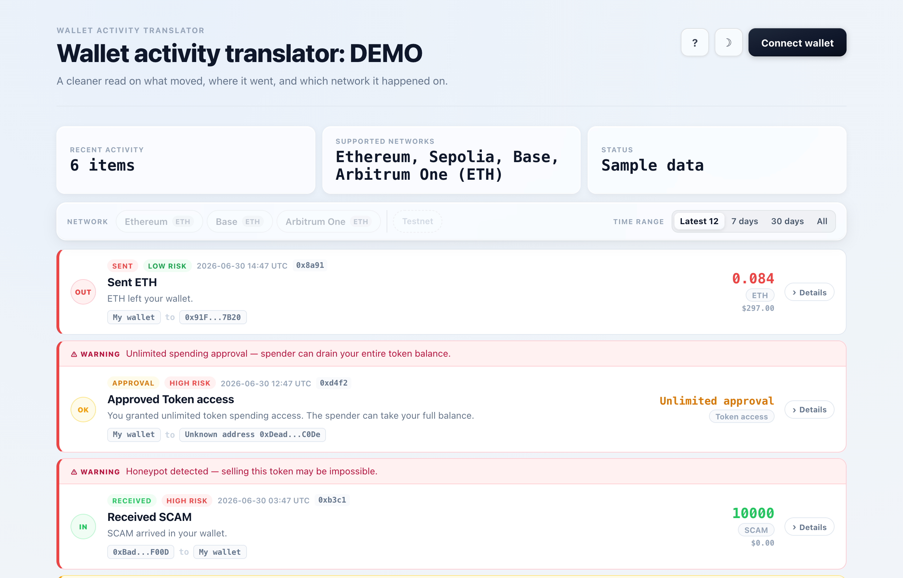

# Wallet Transaction Viewer

A React + TypeScript MVP that translates raw wallet activity into a plain-language
"who moved what, where, and how risky it was" feed — instead of a raw list of
transaction hashes and hex data.

Connect a browser wallet (MetaMask or any injected provider) and it fetches your
recent activity, groups multi-step transactions (like swaps) into a single
readable entry, flags risky approvals, and shows a USD estimate next to each
amount.

## Screenshot



<!-- TODO: demo GIF (connect wallet -> expand a card -> open the risk guide) not recorded yet. -->

## Features

- **Plain-language summaries** — "0.084 ETH left your wallet", "You granted
  unlimited token spending access", etc., instead of raw method calls.
- **Automatic risk scoring** — every transaction is tagged Low / Medium / High /
  Unknown, with a reason (unlimited approvals, honeypot tokens, blacklisted or
  flagged addresses, unverified contracts...). A "How risk levels are decided"
  guide is built into the header.
- **Swap & multi-transfer detection** — an outgoing + incoming pair in the same
  transaction is shown as one swap, not two unrelated transfers.
- **USD estimates** on transfer amounts, via CoinGecko.
- **Multi-chain** — Ethereum, Base, Arbitrum One, and Sepolia (testnet),
  switchable from the header.
- **Time range filters** — Latest 12 / 7 days / 30 days / All.
- **Light & dark theme**, with copy-to-clipboard for addresses and tx hashes.
- Works without connecting anything — it falls back to sample data so the UI
  always has something to show.

## Run locally

```bash
npm install
npm run dev
```

No API keys required — Ethereum, Base, Arbitrum, and Sepolia all use public
Blockscout endpoints for activity data.

```bash
npm run build    # type-check + production build
npm run preview  # preview the production build
```

## How it works

Activity comes from each chain's public Blockscout API. Token security
(honeypot/blacklist/tax checks) and address flags come from GoPlus, and price
estimates come from CoinGecko — all called client-side, no backend required.

This is an MVP: it fetches only the first page of activity per chain (no
pagination yet), so very active wallets may not see their full history under
"All".
